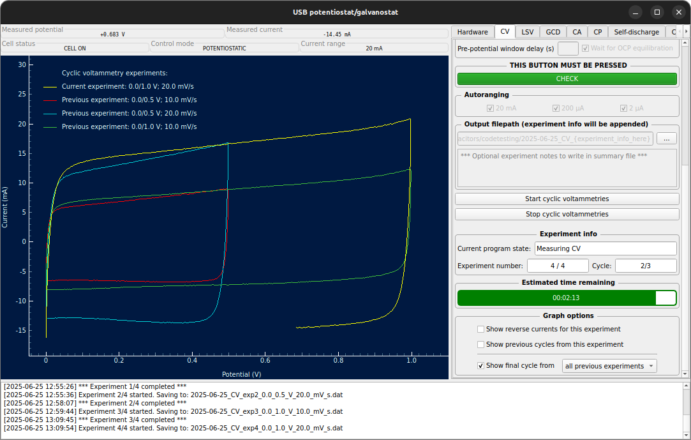

# Summary
We present an open-source graphical user interface (GUI)-based Python program for running and automating electrochemical experiments supporting cyclic voltammetry (CV), linear sweep voltammetry (LSV), Galvanostatic charge/discharge cycling (GCD), chronoamperometry (CA), chronopotentiometry (CP), self-discharge (SD), and rate-testing. Designed to work with low-cost hardware, and specifically an open-source potentiostat/galvanostat design by @dobbelaere2017usb, it provides users with access to electrochemical research capabilities previously constrained to far more expensive apparatus. The program was developed with the following core objectives:

- A queuing and automation of experiments.
- Support for complex experiment workflows, *e.g.*, automated open-circuit potential (OCP) equilibration with the use of "OCP" as an input parameter.
- Accessibility to users with little experience performing electrochemical experiments *via* input parameter validation, GUI dialogue boxes, and comprehensive hover-over tooltips.
- Minimal memory usage by clearing data buffers and enabling of widget resizing *via* GUI software options menu to support a range of hardware resolution and memory configurations.

# Statement of need
Low-cost, "do-it-yourself" (DIY) potentiostats are increasingly widening in utility, with the `CheapStat` [@rowe2011cheapstat], `DStat` [@dryden2015dstat], and `HunStat` [@vamos2024hunstat] providing users the ability to conduct electrochemical experiments at a lower cost than with commercial hardware. However, these are constrained to potentiostatic experiments across limited ranges (\pm$1~\mathrm{V}$ for the `CheapStat` and `DStat`, and \pm$1.65~\mathrm{V}$ for the HunStat). This capability was greatly extended by the `USB Potentiostat/Galvanostat` design presented by @dobbelaere2017usb, with a \pm$8~\mathrm{V}$ potential range enabling the investigation of battery cells at much higher cell potentials. The addition of a galvanostatic mode, and the ability to accurately measure and apply current from nanoamps to \pm$25~\mathrm{mA}$, has significantly broadened the suite of electrochemical experiments accessible to low-cost DIY devices, with the lowest-cost commercial substitute around 20 times more expensive at \$1900 [@squidstatsolo]. The `MYSTAT`, a modification of the `USB Potentiostat/Galvanostat`, pushes this capability even further, achieving maximum potential and current ranges of \pm$12~\mathrm{V}$ and \pm$200~\mathrm{mA}$, respectively [@irving2021mystat].

As is typical for low-cost open source devices, the accompanying GUI software is limited, however, to a narrow range of experiments (CV, GCD, and rate-testing experiments for the `USB Potentiostat/Galvanostat` and the `MYSTAT`), single-experiment execution, and basic input parameters [@caux2022passstat;@kellner2015new;@rowe2011cheapstat;@dryden2015dstat;@vamos2024hunstat;@dobbelaere2017usb;@irving2021mystat]. Commercial potentiostat/galvanostat instruments, whilst broader in utility, lack open source and customisable software for experiment scheduling, data management, and advanced control. 

Our software bridges this gap and provides a flexible, extendable, and user-friendly GUI controller for potentiostat/galvanostat systems, supporting complex experiment workflows and advanced control features. It equips users of the low-cost DIY `USB Potentiostat/Galvanostat` with functionality often confined to the proprietary software of far more expensive instruments, thereby significantly enhancing the accessibility and experimental capabilities for researchers within the low-cost DIY potentiostat/galvanostat ecosystem.

# Features
- Supports CV, LSV, GCD, CA, CP, SD, and rate-testing experiments.
- Experiment queueing using comma-separated variable lists as input parameters.
- Complex experiment workflows by supporting a range of parameter inputs such as potential limits of "1.0, OCP, 2.0, ..." or ramp rates of "5.0, STEP, 10.0, ...", *etc.*
- Potential and current limits to prevent unintended damage to the cell under testing, and equilibration parameters to advance experiments when equilibration conditions are satisfied.
- Alternating potential/current sequences for CA/CP experiments, allowing the user to provide alternating equilibration conditions within the experiment.
- Hover-over tooltips to guide users on supported parameters and their experimental implications, and parameter validity checks with detailed user feedback and correction suggestions.
- Automated OCP equilibration and/or fixed-delay between experiments.
- Automated calculation of 1C capacity for rate-testing using GCD analysis.
- Real-time data logging for individual experiments and experiment progress information logging to a summary file for all queued experiments.
- Progress bars displaying the remaining time, cycles, segments, *etc.*, until all experiments are complete.
- Real-time data visualisation options, including comparisons between experiments within the same queue.
- Post-experiment data visualisation.
- Compatible with Linux, Windows, and Mac operating systems and designed to run on light-weight hardware.
- Can be straightforwardly modified for compatibility with the `MYSTAT`.

# Operating principles
The software is designed to be entirely controlled *via* the GUI window built using `PySide6` [@pyside6], with the users constructing their experiments using the input fields and checkboxes in the corresponding experiment tab. A `CHECK` button for each tab executes an input parameter validation, guiding the user to invalid or incompatible inputs using dialogue boxes. A green `CHECK` button indicates to the user that their experiments are valid and ready to run. An example tab for rate-testing experiments with valid input parameters can be seen in \autoref{fig:rate_tab}. Universal parameters such as the OCP equilibration timescale, tolerance, and timeout threshold, together with more advanced experiment-specific features, are accessible through a software options menu.

The program sequentially executes the queued experiments, handles real-time logging of raw data to individual experiment data files, and writes experiment progress information to a human-readable summary file for all queued experiments. An example GUI seen when running cyclic voltammetry experiments, showing the real-time data visualisation options available to the user, is displayed in \autoref{fig:CV_GUI}.

All experiments are written in a similar code layout, guided by the `PEP 8` standards [@van2001pep] and containing detailed comments, to facilitate users in modifying or adding experiments if required. The typical execution stack that handles the initialisation, running, and stopping of experiments is illustrated in \autoref{fig:flowchart}.

The summary file contains experiment metadata written in a standardised format guided by the FAIR principles [@wilkinson2016fair]. Users may optionally write experiment notes within the GUI to be included at the top of the summary file to assist with post-experiment data contextualisation. An example summary file generated from the CV experiments running in \autoref{fig:CV_GUI} is displayed in \autoref{fig:summary_file}.

To improve software and experimental accessibility, hover-over tooltips are featured for all input parameter fields and checkboxes, guiding the user on their purpose and accepted parameters. An example tooltip is displayed in \autoref{fig:tooltip}.

{width="70%"}

{width="100%"}

{width="100%"}

{width="100%"}

{width="70%"}

# Acknowledgements
This work was supported by the UK Engineering and Physical Sciences Research Council and the Renewable Energy Northeast Universities (ReNU) CDT (EP/S023836/1).

# References
